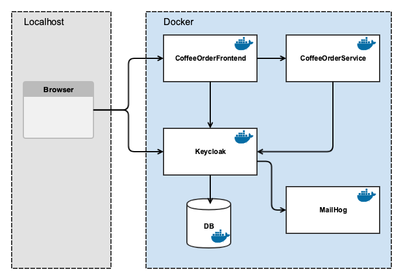

# Info
This service runs only together with
- [coffee-order-frontend](https://github.com/jambit/coffee-order-frontend)
- [coffee-order-service](https://github.com/jambit/coffee-order-service)

checkout and build those projects as well.

# Setup
- install [Docker](https://www.docker.com/products/docker-desktop)

- to make everything work, you must add the following line to your `/etc/hosts`
```
127.0.0.1   keycloak
````

Otherwise the redirects to keycloak do not work. This host **must** be used in all systems which communicate with keycloak (i.e. frontend, backend service, 3rd party identity provider, etc.).

## Setup Keycloak
- create a new realm `CoffeeOrderRealm`
- set Login settings a reqired
- set email 
    - host=`mailserver`
    - port=`1025`
    - from= any sender address you want
- create client `coffee-order-frontend` with 
    - Client Protocol = `openid-connect`
    - Access Type = `public`
    - Valid Redirect URL = `http://localhost:8081/*`
    - Web Origins = `+` (to use all URLs specified in Valid Redirect URL)
- create client `coffee-order-service` with
    - Client Protocol = `openid-connect`
    - Access Type = `bearer-only`
- create role `users` and set this role as default role

# Build
- build project with `mvn clean install`. This builds the war file and the docker images.

# Start
- start everything with `docker compose up`
- NOTE: you must also build the docker containers for `coffee-order-frontend` and `coffee-order-service-spring` first.

# Architecture
 
